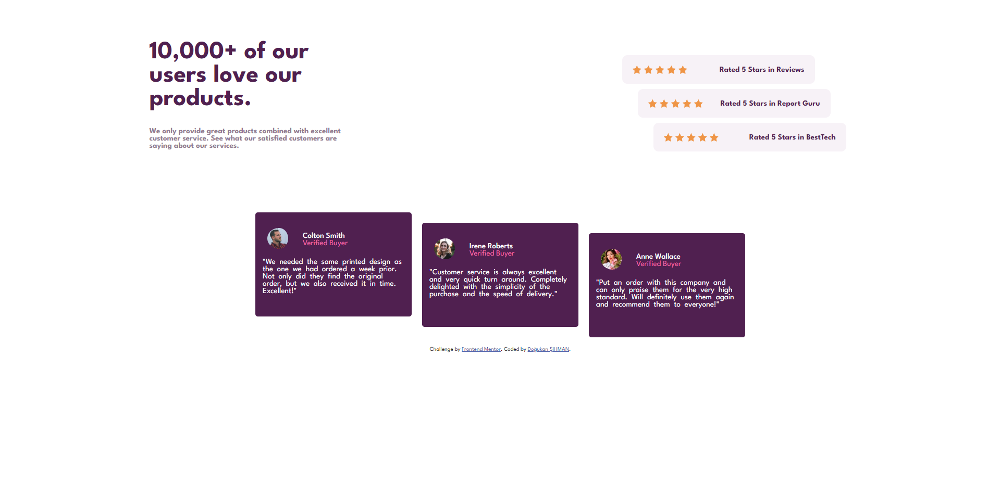
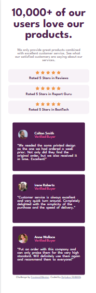
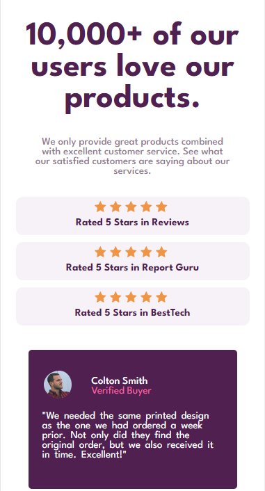

# Frontend Mentor - Social proof section solution

This is a solution to the [Social proof section challenge on Frontend Mentor](https://www.frontendmentor.io/challenges/social-proof-section-6e0qTv_bA). Frontend Mentor challenges help you improve your coding skills by building realistic projects.

## Table of contents

- [Overview](#overview)
  - [The challenge](#the-challenge)
  - [Screenshot](#screenshot)
  - [Links](#links)
- [My process](#my-process)
  - [Built with](#built-with)
  - [What I learned](#what-i-learned)
  - [Continued development](#continued-development)
- [Author](#author)
- [Acknowledgments](#acknowledgments)

## Overview

### The challenge

Users should be able to:

- View the optimal layout for the section depending on their device's screen size

### Screenshot





### Links

- Solution URL: [Here's the link for the solution](https://github.com/dogukan0055/social-proof-section)
- Live Site URL: [Here's the link for the live version](https://dogukan0055.github.io/social-proof-section/)

## My process

### Built with

- Semantic HTML5 markup
- CSS custom properties
- Flexbox
- Mobile-first workflow

### What I learned

I guess that I've learned how to use media queries right this time. And customized some stylesheets as I like. And things are getting easier when you categorize them in the divs. That way, you can't miss a point? :D

```css
:root {
  --magenta: hsl(300, 43%, 22%);
  --pink: hsl(333, 80%, 67%);
  --magenta-light: hsl(300, 24%, 96%);
  --magenta-dark: hsl(303, 10%, 53%);
  --white: hsl(0, 0%, 100%);
  --font: "League Spartan", sans-serif;
}

@media (max-width: 400px) {
  h1,
  p {
    text-align: center;
    width: auto;
  }

  .welcome,
  #stars,
  #comments {
    flex-direction: column;
    margin: auto;
  }

  html,
  body {
    margin: 0;
  }

  .one {
    right: 0;
  }

  .two {
    right: 0;
  }

  .left p {
    max-width: 280px;
    margin: auto;
    font-weight: 500;
  }

  .ratings {
    margin: 5px;
  }

  #stars {
    top: 20px;
  }

  .text {
    word-spacing: 3px;
  }

  .customer .text p {
    margin: 15px 20px;
    text-align: left;
  }

  .customer {
    margin: -3px;
  }

  .container {
    margin: auto;
  }

  .ratings {
    flex-direction: column;
    justify-content: center;
    align-items: center;
    margin: 10px auto;
    max-width: calc(100vw - 100px);
  }

  .ratings p {
    margin: 5px;
  }
}
```

### Continued development

I'm still trying to understand how to create responsive contents. Struggled a bit while trying to make it mobile-ready as well. Creating for desktop is easy peasy for me right now, so the next step is making things responsive.

## Author

- Website - [Doğukan ŞIHMAN](https://dogukansportfolio.w3spaces.com/)
- Frontend Mentor - [@dogukan0055](https://www.frontendmentor.io/profile/dogukan0055)
- Twitter - [@bedavatekme](https://www.twitter.com/bedavatekme)

## Acknowledgments

I've built this project on my own, without any help. When I got stuck, I'm opening DevTools and trying to figure it out from there, and thanks to its live preview, things are becoming much easier to deal with.
